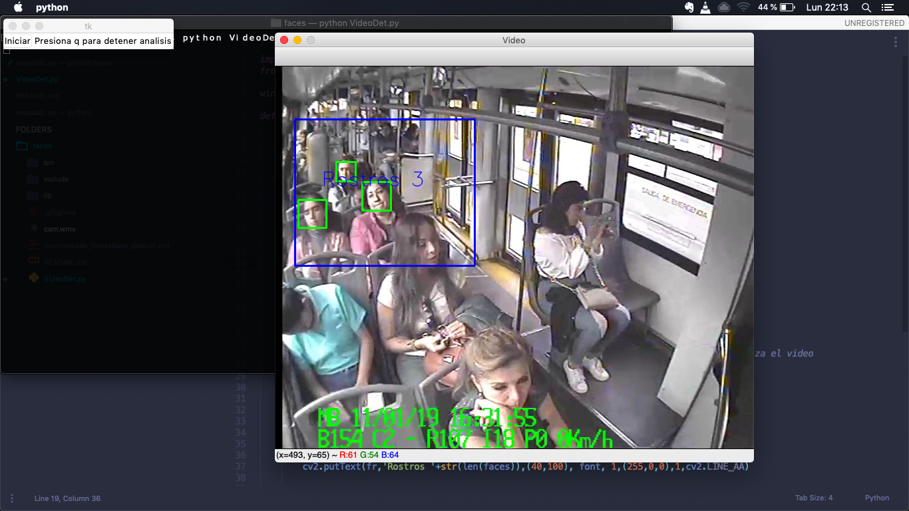

## Uso de libreria Open CV para reconocimiento de imagen

Instalar dependencias:

```
pip install opencv-python
```

Ejecutar script:

```
python VideoDet.py
```

Modo de uso:

1. Dar clic en boton **Iniciar**
2. Seleccionar con mouse el area a analizar
3. Presionar tecla **Enter**
4. Para Cerrar la ventana del video presionar la tecla **q**

ScreenCast:

[https://cl.ly/3eda010b1d90](https://cl.ly/3eda010b1d90)
[https://cl.ly/52f332a102a4](https://cl.ly/52f332a102a4)




> Nota
> - Se utilizó el video proporcionado con el nombre de cam.wmv
> - Se selecciona por medio del mouse un area a analizar

